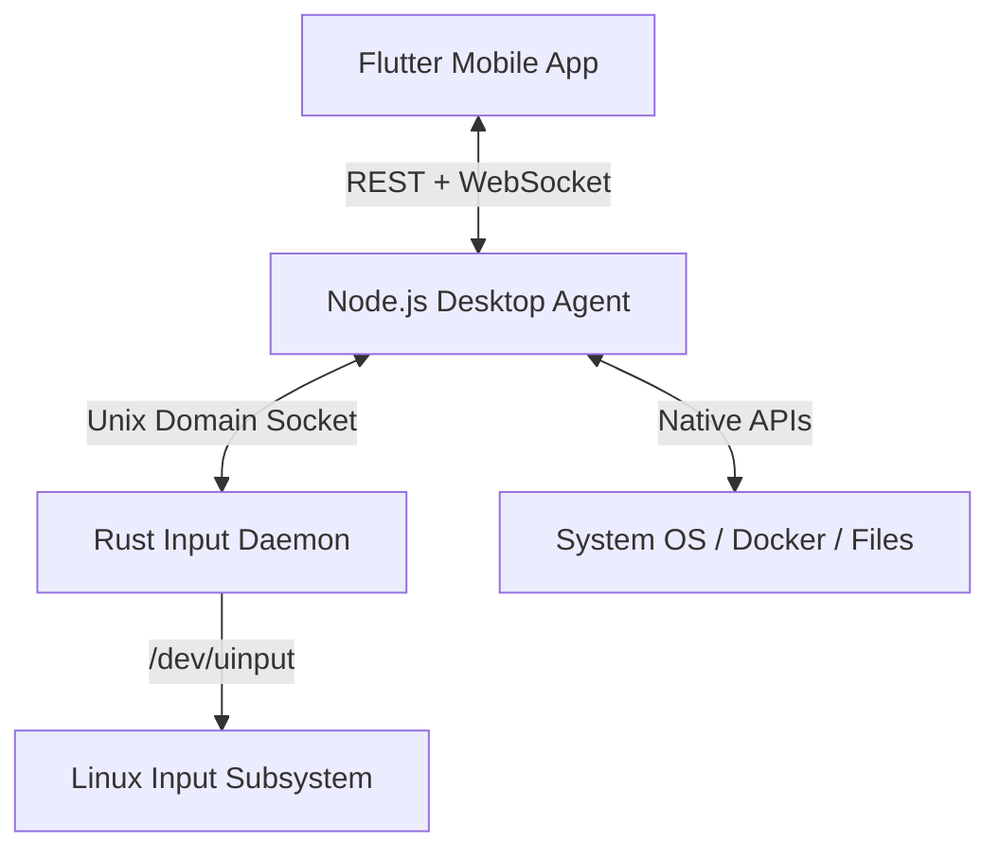

<div align="center">
  <h1>🚀 Developer Control Hub (DevControl)</h1>
  <p><b>A secure, extensible LAN-based desktop management platform for developers.</b></p>
  <p>
    <a href="https://github.com/your-username/devcontrol/actions"></a>
    <a href="https://flutter.dev"></a>
    <a href="https://nodejs.org/"></a>
    <a href="https://rust-lang.org"></a>
    <a href="LICENSE"></a>
  </p>
</div>

---

**Developer Control Hub (DevControl)** is a secure LAN-based remote control and monitoring application designed specifically for developers. Instead of generic desktop streaming, DevControl focuses on automation, system monitoring, process management, terminal access, and direct Docker control natively from your mobile phone.

## ✨ Key Features

- 🔍 **Auto-Discovery & Secure Pairing**: Zero-config mDNS discovery on your LAN. Securely pair using 8-character codes and JWT-based authentication.
- 📊 **Real-time System Monitoring**: Live CPU, RAM, Battery, and Uptime telemetry with animated gauge cards.
- 📱 **Interactive Terminal**: Full color-coded, interactive shell sessions (`bash`/`zsh`) directly from your phone over WebSockets.
- 🐳 **Docker Management**: View, start, stop, and restart containers, plus tail live logs directly from the UI.
- 📁 **File Manager**: Browse, upload, download, edit, and move files right on your mobile device.
- 🔔 **Notification Mirroring**: Natively intercept Linux Desktop notifications (via D-Bus) and mirror them directly to your phone.
- ⚙️ **Automation Engine**: Define custom rules (e.g., CPU > 90%) to trigger specific shell scripts or alerts automatically.
- 📋 **Clipboard Sync**: Bi-directional clipboard syncing between your mobile device and your workstation.
- 🖱️ **Remote Input Subsystem (Rust)**: High-performance virtual mouse and keyboard device emulation via Linux `uinput`.

## 🏗️ Architecture Overview

The system is broken down into three modular components:



## 📂 Project Structure

```text
saturday/
├── agent/                # Desktop Agent (Fastify, TypeScript, SQLite)
├── mobile/               # Mobile Application (Flutter, Dart, Material 3)
├── rust/                 # High-performance Input Daemon (Rust, uinput)
├── shared/               # Shared API types and contracts
└── docs/                 # Project documentation and plans
```

## 🚀 Getting Started

### Prerequisites

* **Node.js** (v20+ recommended)
* **Flutter** (v3.10+ recommended)
* **Rust** (Optional, for the remote input daemon)

### 1. Launch the Desktop Agent

Initialize the agent to start mDNS discovery and the REST/WebSocket gateway:

```bash
cd agent
npm install
npm run dev
# Or for production: npm run build && npm start
```

The agent will output a secure **8-character pairing code**. It starts broadcasting as `_devcontrol._tcp` using mDNS.

### 2. Launch the Mobile Client

Run the Flutter client on your mobile device (ensure it is on the same local network):

```bash
cd mobile/flutter_app
flutter pub get
flutter run
```

* **Auto-Discovery**: The app automatically finds your workstation.
* **Pair**: Tap your host, enter the pairing code, and access the dashboard.
* **Auto-Reconnect**: On subsequent launches, the app automatically attempts to reconnect to your workstation seamlessly.

### 3. (Optional) Run the Rust Input Daemon

For virtual mouse and keyboard control capabilities:

```bash
cd rust
cargo build --release
sudo mkdir -p /run/devcontrol && sudo chown $USER /run/devcontrol
./target/release/devcontrol-input
```

*(See [rust/README.md](./rust/README.md) for background systemd setup instructions).*

## 🧪 Testing

```bash
# Test Desktop Agent
cd agent && npm run test

# Test Flutter Client
cd mobile/flutter_app && flutter test
```

## 🗺️ Roadmap & Documentation

To see our future plans (Biometric Unlock, Git Manager, Project Launcher), view the detailed [Project Plan](plan.md) and [Completed Features](completed.md).

## 📄 License

This project is licensed under the [MIT License](LICENSE).
